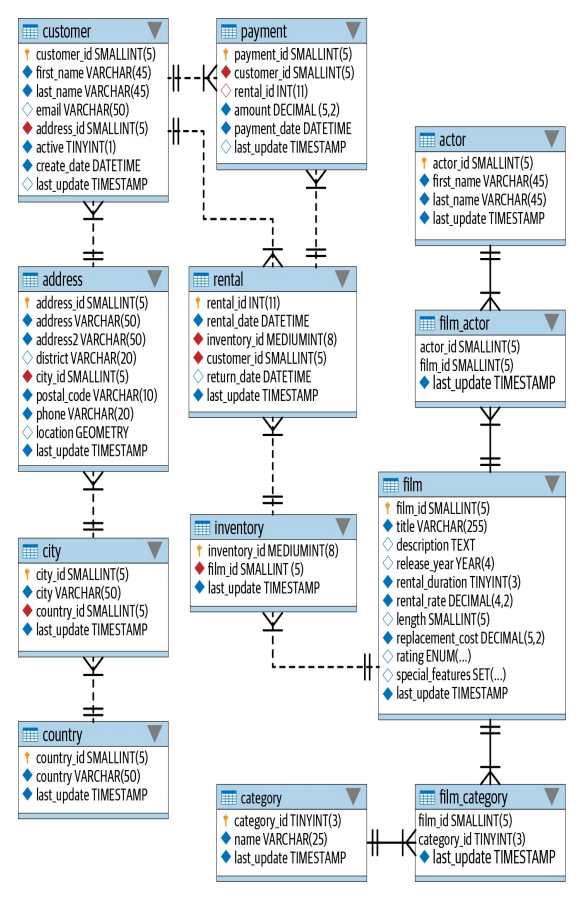

# Learning SQL from Learning SQL - Generate, Manipulate, and Retrieve Data by Alan Beaulieu

## Chapter 2. Creating and Populating a Database

### Creating a MySQL Database

Run `.sql` file from `sakila-db` server

### Using the mysql Command-Line Tool

1. Logging in from Windows shell
    ```
   mysql -u root -p;
   ```

2. See all the available databases
    ```
   show databases;
   ```

3. Specify the database to work with
    ```
   use sakila;
   ```

4. Clear window screen
   ```
   mysql> \! cls
   ```

### MySQL Data Types

#### Character Data

    char(20)    /* fixed-length */
    varchar(20) /* variable-length */

- `tinytext` - 255 bytes

- `text` - 65535 bytes

- `mediumtext` - 16777215 bytes

- `longtext` - 4294967295 bytes

#### Numeric Data

##### MySQL integer types

- `tinyint` - -128 to 127

- `smallint` - -32,768 to 32,767

- `mediumint` - -8,388,608 to 8,388,607

- `int` - −2,147,483,648 to 2,147,483,647

- `bigint` - -2^63 to 2^63 - 1

##### MySQL floating-point types

- `float(p, s)` and `double(p, s)`

> For example, a column defined as float(4,2) will store a total of four digits, two to the left of the decimal and two
> to the right of the decimal. Therefore, such a column would handle the numbers 27.44 and 8.19 just fine, but the number
> 17.8675 would be rounded to 17.87, and attempting to store the number 178.375 in your float(4,2) column would generate
> an error.

#### Temporal Data

- `date` - YYYY-MM-DD

  Columns to hold the expected future shipping date of a customer order and an employee’s birthdate would use the date
  type, since it is unrealistic to schedule a future shipment down to the second and unnecessary to know at what time a
  person was born.
- `datetime` - YYYY-MM-DD HH:MI:SS

  A column to hold information about when a customer order was actually shipped would use the datetime type, since it is
  important to track not only the date that the shipment occurred but the time as well.
- `timestamp` - YYYY-MM-DD HH:MI:SS

  A column that tracks when a user last modified a particular row in a table would use the timestamp type. The timestamp
  type holds the same information as the datetime type (year, month, day, hour, minute, second), but a timestamp column
  will automatically be populated with the current date/time by the MySQL server when a row is added to a table or when
  a row is later modified.
- `year` - YYYY

  A column holding just year data would use the year type.
- `time` - HHH:MI:SS

  Columns that hold data regarding the length of time needed to complete a task would use the time type. For this type
  of data, it would be unnecessary and confusing to store a date component, since you are interested only in the number
  of hours/minutes/seconds needed to complete the task. This information could be derived using two datetime columns (
  one for the task start date/time and the other for the task completion date/time) and subtracting one from the other,
  but it is simpler to use a single time column.

### Table Creation

#### SQL Schema Statements

1. Person Table
   ```
   CREATE TABLE person (
      person_id SMALLINT UNSIGNED,
      fname VARCHAR(20),
      lname VARCHAR(20),
      eye_color ENUM('BR', 'BL', 'GR'), /* eye_color CHAR(2) CHECK (eye_color IN ('BR','BL','GR')), */
      birth_date DATE,
      street VARCHAR(30),
      city VARCHAR(20),
      state VARCHAR(20),
      country VARCHAR(20),
      postal_code VARCHAR(20),
      CONSTRAINT pk_person PRIMARY KEY (person_id)
   );
   ```

   ```
   mysql> desc person;
   ```

2. Favorite_food Table
   ```
   CREATE TABLE favorite_food (
      person_id SMALLINT UNSIGNED,
      food VARCHAR(20),
      CONSTRAINT pk_favorite_food PRIMARY KEY (person_id, food),
      CONSTRAINT fk_fav_food_person_id FOREIGN KEY (person_id) REFERENCES person (person_id)
   );
   ```

### Population and Modifying Tables

#### Inserting Data

##### Generating Numeric Key Data

   ```
   ALTER TABLE person
   MODIFY person_id SMALLINT UNSIGNED AUTO_INCREMENT;
   ```

##### The INSERT Statement

   ```
   INSERT INTO person
   (person_id, fname, lname, eye_color, birth_date)
   VALUES (null, 'William', 'Turner', 'BR', '1972-05-27');
   
   INSERT INTO favorite_food (person_id, food)
   VALUES (1, 'pizza');
   ```

#### Updating Data

   ```
   UPDATE person
   SET street = '1225 Tremont St.',
      city = 'Boston',
      state = 'MA',
      country = 'USA',
      postal_code = '02138'
   WHERE person_id = 1;
   ```

   ```
   UPDATE person
   SET birth_date = str_to_date('DEC-21-1980', '%b-%d-%Y')
   WHERE person_id = 1;
   ```

- `%a` The short weekday name, such as Sun, Mon, ...
- `%b` The short month name, such as Jan, Feb, ...
- `%c` The numeric month (0..12)
- `%d` The numeric day of the month (00..31)
- `%f` The number of microseconds (000000..999999)
- `%H` The hour of the day, in 24-hour format (00..23)
- `%h` The hour of the day, in 12-hour format (01..12)
- `%i` The minutes within the hour (00..59)
- `%j` The day of year (001..366)
- `%M` The full month name (January…December)
- `%m` The numeric month
- `%p` AM or PM
- `%s` The number of seconds (00..59)
- `%W` The full weekday name (Sunday…Saturday)
- `%w` The numeric day of the week (0=Sunday..6=Saturday)
- `%Y` The four-digit year

#### Delete Data

   ```
   DELETE FROM person
   WHERE person_id = 2;
   ```

### The Sakila Database



**Customer SQL Schema Statement**

    CREATE TABLE customer (
        customer_id SMALLINT UNSIGNED NOT NULL AUTO_INCREMENT,
        store_id TINYINT UNSIGNED NOT NULL, 
        first_name VARCHAR(45) NOT NULL,
        last_name VARCHAR(45) NOT NULL, 
        email VARCHAR(50) DEFAULT NULL, 
        address_id SMALLINT UNSIGNED NOT NULL, 
        active BOOLEAN NOT NULL DEFAULT TRUE, 
        create_date DATETIME NOT NULL, 
        last_update TIMESTAMP DEFAULT CURRENT_TIMESTAMP ON UPDATE CURRENT_TIMESTAMP, 
        PRIMARY KEY  (customer_id), 
        KEY idx_fk_store_id (store_id), --Create index, MUL means can be duplicate value--
        KEY idx_fk_address_id (address_id), 
        KEY idx_last_name (last_name), 
        CONSTRAINT fk_customer_address FOREIGN KEY (address_id) REFERENCES address (address_id) ON DELETE RESTRICT ON UPDATE CASCADE, 
        CONSTRAINT fk_customer_store FOREIGN KEY (store_id) REFERENCES store (store_id) ON DELETE RESTRICT ON UPDATE CASCADE
    ) ENGINE=InnoDB DEFAULT CHARSET=utf8mb4;

## Chapter 3. Query Primer

### Query Mechanics

### Query Clauses

- `select` - Determines which columns to include in the query's result set
- `from` - Identifies the tables from which to retrieve data and how the tables should be joined
- `where` - Filters out unwanted data
- `group by` - Used to group rows together by common column values
- `having` - Filters out unwanted groups
- `order by` - Sorts the rows of the final result set by one or more columns

### The SELECT Clause

One of the last clauses that the database server evaluates. The SELECT clause determines which of all possible columns
should be included in the query's result set

    SELECT *
    FROM language;

Include things in SELECT clause:

- Literals, such as numbers or strings
- Expressions, such as `transaction.amount * -1`
- Build-in function calls, such as `ROUND(transaction.amount, 2)`
- User-defined function calls

    ```
    SELECT language_id,
        'COMMON' language_usage,  --Literal--
        language_id * 3.1415927 lang_pi_value,  --Expression--
        upper(name) language_name  --Build-in function- 
    FROM language;  
    ```

#### Column Aliases

From previous: `upper(name) language_name`, `language_name` is column alias

Option: Using `as` before the alias name: `SELECT language_id * 3.1415927 AS lang_pi_value`

#### Removing Duplicates

    SELECT DISTINCT actor_id FROM film_actor ORDER BY actor_id

### The FROM Clause

The `FROM` clause defines the tables used by a query, along with the means of linking the tables together

#### Tables

Four different types of tables:

- Permanent tables (i.e., created using the `create table` statement)

- Derived (Subquery-Generated) tables (i.e., rows returned by a subquery and held in memory)

    ```
    SELECT concat(cust.last_name, ', ', cust.first_name) AS full_name
    FROM (
        SELECT first_name, last_name, email
        FROM customer
        WHERE first_name = 'JESSIE'
    ) AS cust;
    ```

- Temporary tables (i.e., volatile data held in memory): These tables look just like permanent tables, but any data
  inserted into a temporary table will disappear at some point (generally at the end of a transaction or when your
  database session is closed)

    ```
    CREATE TEMPORARY TABLE actor_j (
        actor_id smallint(5),
        first_name varchar(45),
        last_name varchar(45)
    );

    INSERT INTO actor_j
    SELECT actor_id , first_name, last_name
    FROM actor
    WHERE last_name LIKE 'J%';

    SELECT * FROM actor_j

    --Data will disappear after your session is closed--
    ```

- Virtual tables or Views (i.e., created using the `create view` statement): A view is a query that is stored in the
  data dictionary. When you issue a query against a view, your query is merged with the view definition to create a
  final query to be executed.

    ```
    CREATE VIEW curt_vw AS
    SELECT customer_id, first_name, last_name, active
    FROM customer;

    --When the view is created, no additional data is generated or stored--
    ```

#### Table Links

    SELECT customer.first_name, customer.last_name, time(rental.rental_date) rental_time
    FROM customer
        INNER JOIN rental
        ON customer.customer_id = rental.customer_id
    WHERE date(rental.rental_date) = '2005-06-14';

#### Defining Table Aliases

    SELECT c.first_name, c.last_name, 
        time(r.rental_date) rental_time
    FROM customer c
        INNER JOIN rental r
        ON c.customer_id = r.customer_id
    WHERE date(r.dental_date) = '2005-06-14';

### The WHERE Clause
The `WHERE` clause is the mechanism for filtering out unwanted rows for your result set.
    
    SELECT title 
    FROM film
    WHERE rating = 'G' AND rental_duration >= 7;
    --Individual conditions are separated using operators such as AND, OR, NOT--

### The GROUP BY and HAVING Clauses
